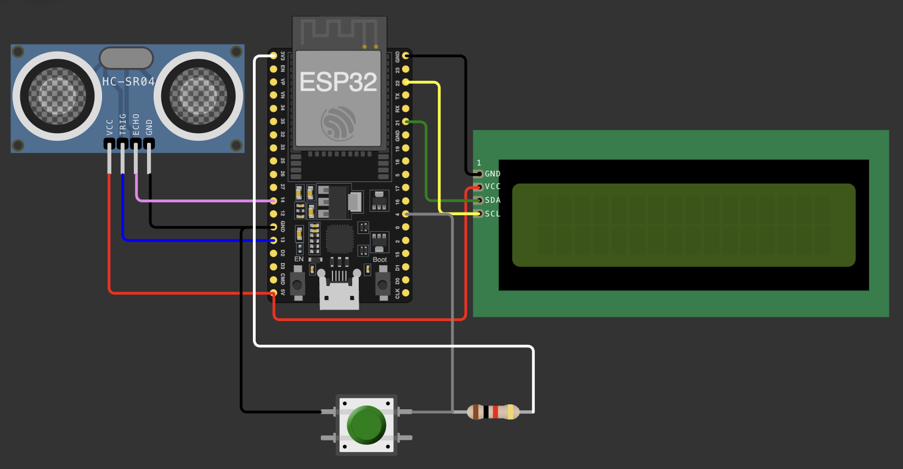

#   Entfernungsmesser

Dies ist ein kleines Projekt für einen Entfernungsmesser.
Reichweite ungefähr 2cm bis 2m.

## Bauteile:
-   ESP32 Mikrocontroller   (Ich habe einen ESP32 von Freenove benutzt, Pins zu anderen ESP32-Boards variieren)
-   1602IIC 16x2 LCD Display (I2C)
-   HC-SR04 Ultraschallwandler
-   Button mit Pull-Up Widerstand (10k Ω)

## Aufbau

## Bibliotheken

Für das kleine Projekt wurden zwei Bibliotheken benutzt:
-   LiquidCrystal_I2C.h
    -   Treiber für den 16x2 LCD Bildschirm
-   Wire.h
    -   Treiber für I2C Bus

Für den HC-SR04 Ultraschallwandler gäbe es auch eine Bibliothek, ist aber nicht von mir verwendet worden.

##  Pinbelegung des ESP32

|   Pin     |   Benutzung           |
|-----------|-----------------------|
|   4       |   Push-Button         |
|   13      |   HC-SR04: TRIG       |
|   14      |   HC-SR04: ECHO       |
|   21      |   1602IIC: SDA I2C    |
|   22      |   1602IIC: SCL I2C    |

####    Wichtig:
HC-SR04 Ultraschallwandler und 1602IIC LCD Display müssen mit VCC an 5V angeschlossen werden.
Der Pull-UP Widerstand muss an 3,3V angeschlossen werden.